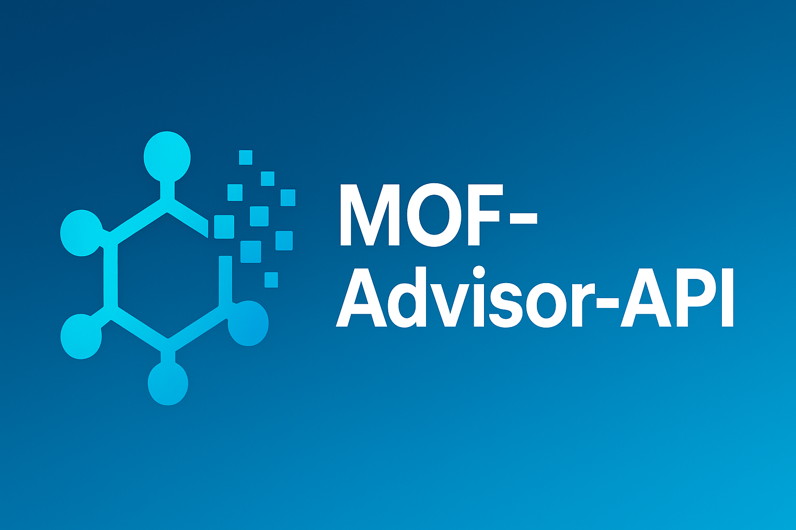

<div align="center">
  <a href="https://github.com/lichman0405/MOF-Advisor-API.git">
    
  </a>
  
  <h1 align="center">MOF-Advisor-API</h1>
  
  <p align="center">
    An intelligent suggestion API for MOF (Metal-Organic Framework) synthesis methods, based on RAG (Retrieval-Augmented Generation) and multi-model support, with a dynamically updatable knowledge base.  
    <br>
    <a href="./README-en.md"><strong>English</strong></a>
    ·
    <a href="https://github.com/lichman0405/MOF-Advisor-API.git/issues">Report Bug</a>
    ·
    <a href="https://github.com/lichman0405/MOF-Advisor-API.git/issues">Request Feature</a>
  </p>
</div>

<div align="center">

[](https://opensource.org/licenses/MIT) [](https://www.python.org/)   [](https://github.com/lichman0405/MOF-Advisor-API.git/issues) [](https://github.com/lichman0405/MOF-Advisor-API.git)

</div>


## 📖 Project Overview

MOF-Advisor-API is a backend project designed to transform a large collection of academic papers in the field of MOF synthesis into an intelligent, interactive API service. Users can query the API for synthesis methods of MOFs with specific metal sites and organic linkers. The core feature of the system is that it not only retrieves and summarizes synthesis protocols from the existing literature knowledge base but also, when the knowledge base lacks relevant information, intelligently generates a theoretically feasible "fallback" suggestion using the LLM's embedded chemical knowledge.

Furthermore, this project supports dynamically uploading new papers via API to continually expand and update the knowledge base, making it a platform capable of continuous learning and growth.

## ✨ Core Features

- **Dynamic Knowledge Base**: Supports uploading single or multiple `.md` papers through API endpoints to extend the knowledge base dynamically.
- **Intelligent Data Extraction**: Utilizes large language models (LLMs) to automatically extract structured key synthesis parameters from unstructured paper text.
- **RAG-enhanced Generation**: Constructs a RAG pipeline based on SentenceTransformer and ChromaDB to accurately retrieve the most relevant synthesis literature as context for user queries.
- **Intelligent Fallback Mechanism**: When no relevant information is found in the knowledge base, the API switches to pure LLM generation mode to provide a theoretically sound suggestion based on general chemical principles.
- **Feasibility Pre-validation**: Before generating any suggestion, the system performs a quick feasibility check on the requested chemical combination via the LLM, filtering out obviously unreasonable requests.
- **Multi-Model Support**: Easily switch between multiple LLM providers (e.g., DeepSeek, Gemini, ChatGPT) by adjusting environment variables.
- **Professional Project Architecture**: Built with FastAPI, featuring a clear and extensible structure, along with an aesthetically pleasing and informative logging system powered by Rich.

## 🏗️ Architecture Overview

This project’s core architecture is divided into two main parts: the offline data processing pipeline and the online API service.

### Data Processing Pipeline (`scripts/ingest_data.py`)

1. Read raw `.md` papers  
2. Invoke the LLM to extract key information (in JSON format)  
3. Generate text embeddings using SentenceTransformer (e.g., `BAAI/bge-m3`)  
4. Store embeddings in the ChromaDB vector database  

### API Service (`main.py`)

1. FastAPI receives HTTP requests  
2. `rag_service` performs a feasibility check  
3. `rag_service` vectorizes the query with SentenceTransformer  
4. Retrieve context from ChromaDB  
5. `rag_service` constructs prompts and calls the LLM to generate the final response  
6. Return a JSON response  

## 📂 Project Structure

```
MOF-Advisor-API/
├── app/                  # Core code for the FastAPI application
│   ├── api/              # API routes and endpoints
│   ├── core/             # Core services and logic (logger, rag_service, ingestion_service)
│   ├── models/           # Pydantic data models
│   └── config.py         # Configuration center
├── data/                 # Raw data
│   └── papers/           # Store `.md` paper files
├── scripts/              # Maintenance and diagnostic scripts
│   ├── ingest_data.py    # Data ETL script
│   ├── inspect_db.py     # Database inspection script
│   └── debug_config.py   # Configuration diagnostic script
├── chroma_db/            # (Auto-generated) Vector database
├── .env                  # Local environment variables file
├── .gitignore            # Git ignore file
├── Dockerfile            # Docker deployment blueprint
├── docker-compose.yml    # Docker Compose configuration
├── main.py               # Application entry point
└── requirements.txt      # Python dependencies
```

## 🚀 Installation & Setup

1. **Clone the repository**

   ```bash
   git clone https://your-repository-url/MOF-Advisor-API.git
   cd MOF-Advisor-API
   ```

2. **Create and activate a Python virtual environment**

   ```bash
   python -m venv venv
   source venv/bin/activate  # macOS/Linux
   # venv\Scriptsctivate   # Windows
   ```

3. **Install dependencies**

   ```bash
   pip install -r requirements.txt
   ```

4. **Configure environment variables**

   - Copy `.env.example` (if provided) to `.env`, or create a new `.env` file.  
   - Fill in the required variables, especially `LLM_PROVIDER` and the API keys for your chosen providers.

   **Example `.env` file:**

   ```env
   # Main toggle for selecting the LLM provider
   LLM_PROVIDER="DEEPSEEK_CHAT"

   # API credentials for each provider
   DEEPSEEK_CHAT_API_KEY="sk-..."
   DEEPSEEK_CHAT_MODEL="deepseek-chat"
   DEEPSEEK_CHAT_BASE_URL="https://api.deepseek.com/v1"

   # Other settings
   PAPERS_DIR="./data/papers"
   DB_PATH="./chroma_db"
   ```

## 🛠️ Usage

1. **Populate the knowledge base**

   - **Full or forced refresh** (clears existing database):  
     ```bash
     python scripts/ingest_data.py --force
     ```
   - **Incremental update** (processes new files only):  
     ```bash
     python scripts/ingest_data.py
     ```

2. **Run the API service**

   It's recommended to use Docker Compose:

   ```bash
   docker-compose up -d --build
   ```

   - View logs:  
     ```bash
     docker-compose logs -f
     ```
   - Stop the service:  
     ```bash
     docker-compose down
     ```

   After startup, access the interactive API docs at `http://localhost:8000/docs`.

3. **API Endpoints**

   - **POST /api/v1/suggest**: Get synthesis suggestions  
   - **POST /api/v1/ingest/file**: Upload a single paper  
   - **POST /api/v1/ingest/files**: Upload multiple papers  

## 🔧 Configuration

All settings are managed via the `.env` file at the project root and loaded by `app/config.py`. The key setting `LLM_PROVIDER` determines which LLM backend to use, such as `"GEMINI"` or `"CHATGPT"`.

## 📝 License

This project is licensed under the MIT License.
