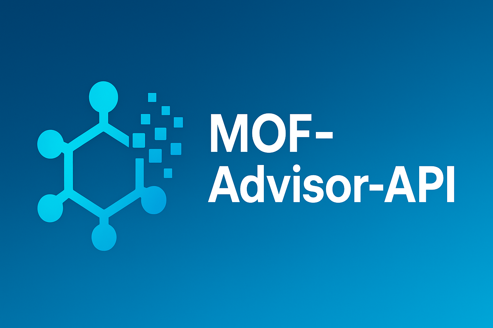

<div align="center">
  <a href="https://github.com/lichman0405/MOF-Advisor-API.git">
    
  </a>
  
  <h1 align="center">MOF-Advisor-API</h1>
  
  <p align="center">
    一个基于 RAG（检索增强生成）和多模型支持的、可动态更新知识库的 MOF（金属有机框架）合成方法智能建议 API。  
    <br>
    <a href="./README-en.md"><strong>English</strong></a>
    ·
    <a href="https://github.com/lichman0405/MOF-Advisor-API.git/issues">Report Bug</a>
    ·
    <a href="https://github.com/lichman0405/MOF-Advisor-API.git/issues">Request Feature</a>
  </p>


<p>
  <a href="https://opensource.org/licenses/MIT"></a>
  <a href="https://www.python.org/"></a>
  <a href="https://fastapi.tiangolo.com/"></a>
  <a href="https://www.docker.com/"></a>
  <a href="https://github.com/lichman0405/MOF-Advisor-API/issues"></a>
  <a href="https://github.com/lichman0405/MOF-Advisor-API"></a>
</p>
</div>


## 📖 项目简介 (Overview)

MOF-Advisor-API 是一个旨在将大量 MOF 合成领域的学术论文，转化为一个智能、可交互的 API 服务的后端项目。用户可以通过 API 查询特定金属位点和有机配体的 MOF 合成方法。系统的核心特色在于，它不仅能从现有的文献知识库中检索并总结出合成方案，还能在知识库内容不足时，利用大语言模型自身的化学知识，智能地生成一个理论上可行的“回退”建议。

此外，本项目还支持通过 API 动态上传新的论文，不断扩充和更新其知识库，使其成为一个能够持续学习和成长的平台。

## ✨ 核心功能 (Core Features)

- **动态知识库**：支持通过 API 接口上传单篇或多篇 `.md` 格式的论文，实现知识库的动态扩展。
- **智能数据提取**：利用大语言模型（LLM）从非结构化的论文文本中自动提取结构化的关键合成参数。
- **RAG 增强生成**：基于 SentenceTransformer 和 ChromaDB 构建的 RAG 管线，能根据用户查询，精确检索最相关的合成文献作为上下文。
- **智能回退机制**：当知识库中没有相关信息时，API 不会简单地失败，而是切换到纯 LLM 生成模式，给出一个基于通用化学知识的理论建议。
- **可行性预验证**：在生成任何建议之前，系统会先调用 LLM 对用户请求的化学组合进行一次快速的可行性判断，过滤掉明显不合理的请求。
- **多模型支持**：通过简单的环境变量配置，可以轻松在多种大语言模型（如 DeepSeek, Gemini, ChatGPT 等）之间进行切换。
- **专业的项目架构**：采用 FastAPI 构建，拥有清晰且可扩展的项目结构，以及基于 Rich 的、美观且信息丰富的日志系统。

## 🏗️ 架构概览 (Architecture Overview)

本项目的核心架构分为两个部分：离线的数据处理管线和在线的 API 服务。

### 数据处理管线 (`scripts/ingest_data.py`)

1. 读取原始 `.md` 论文  
2. 调用 LLM 进行信息提取（JSON 格式）  
3. 使用 SentenceTransformer（例如 `BAAI/bge-m3`）生成文本摘要的向量  
4. 存入 ChromaDB 向量数据库  

### API 服务 (`main.py`)

1. FastAPI 接收 HTTP 请求  
2. `rag_service` 进行可行性检查  
3. `rag_service` 用 SentenceTransformer 将查询向量化  
4. 从 ChromaDB 检索上下文  
5. `rag_service` 构建 Prompt 并调用 LLM 生成最终答案  
6. 返回 JSON 响应  

## 📂 项目结构 (Project Structure)

```
MOF-Advisor-API/
├── app/                  # FastAPI 应用核心代码
│   ├── api/              # API 路由/端点
│   ├── core/             # 核心服务和逻辑 (logger, rag_service, ingestion_service)
│   ├── models/           # Pydantic 数据模型
│   └── config.py         # 统一配置中心
├── data/                 # 原始数据
│   └── papers/           # 存放 `.md` 论文文件
├── scripts/              # 运维和诊断脚本
│   ├── ingest_data.py    # 数据 ETL 脚本
│   ├── inspect_db.py     # 数据库检查脚本
│   └── debug_config.py   # 配置诊断脚本
├── chroma_db/            # (自动生成) 向量数据库
├── .env                  # 环境变量配置文件 (本地)
├── .gitignore            # Git 忽略文件
├── Dockerfile            # Docker 部署蓝图
├── docker-compose.yml    # Docker Compose 部署文件
├── main.py               # 应用入口
└── requirements.txt      # Python 依赖
```

## 🚀 安装与配置 (Installation & Setup)

1. **克隆项目**

   ```bash
   git clone https://your-repository-url/MOF-Advisor-API.git
   cd MOF-Advisor-API
   ```

2. **创建并激活 Python 虚拟环境**

   ```bash
   python -m venv venv
   source venv/bin/activate  # on macOS/Linux
   # venv\Scriptsctivate   # on Windows
   ```

3. **安装依赖**

   ```bash
   pip install -r requirements.txt
   ```

4. **配置环境变量**

   - 将 `.env.example`（如果提供）复制为 `.env`，或手动创建一个 `.env` 文件。  
   - 根据需求填写必要的环境变量，尤其是 `LLM_PROVIDER` 和各提供商的 API 密钥。

   **.env 文件示例：**

   ```env
   # 主开关，选择要使用的 LLM 提供商
   LLM_PROVIDER="DEEPSEEK_CHAT"

   # 为所有想使用的提供商配置变量
   DEEPSEEK_CHAT_API_KEY="sk-..."
   DEEPSEEK_CHAT_MODEL="deepseek-chat"
   DEEPSEEK_CHAT_BASE_URL="https://api.deepseek.com/v1"

   # 其他配置
   PAPERS_DIR="./data/papers"
   DB_PATH="./chroma_db"
   ```

## 🛠️ 使用方法 (Usage)

1. **填充知识库**

   - **首次或强制刷新所有数据**（会清空现有数据库）：  

     ```bash
     python scripts/ingest_data.py --force
     ```

   - **增量更新**（只处理新文件）：  

     ```bash
     python scripts/ingest_data.py
     ```

2. **运行 API 服务**

   推荐使用 Docker Compose：

   ```bash
   docker-compose up -d --build
   ```

   - 查看服务日志：  

     ```bash
     docker-compose logs -f
     ```

   - 停止服务：  

     ```bash
     docker-compose down
     ```

   服务启动后，可在 `http://localhost:8000/docs` 访问交互式 API 文档。

3. **API 接口示例**

   - **POST /api/v1/suggest**: 获取合成建议  

     ```bash
     curl -X 'POST'        'http://localhost:8000/api/v1/suggest'        -H 'accept: application/json'        -H 'Content-Type: application/json'        -d '{
         "metal_site": "Copper",
         "organic_linker": "BTC"
       }'
     ```

   - **POST /api/v1/ingest/file**: 上传单个论文  

     ```bash
     curl -X 'POST'        'http://localhost:8000/api/v1/ingest/file'        -H 'accept: application/json'        -F 'file=@/path/to/your/new_paper.md'
     ```

   - **POST /api/v1/ingest/files**: 批量上传论文  

     ```bash
     curl -X 'POST'        'http://localhost:8000/api/v1/ingest/files'        -H 'accept: application/json'        -F 'files=@/path/to/paper1.md'        -F 'files=@/path/to/paper2.md'
     ```

## 🔧 配置 (Configuration)

所有配置通过根目录下的 `.env` 文件管理，并由 `app/config.py` 统一加载。核心配置项 `LLM_PROVIDER` 决定了项目使用的后端 LLM，如 `"GEMINI"`、`"CHATGPT"` 等。

## 📝 许可证 (License)

本项目采用 **MIT License** 授权。
